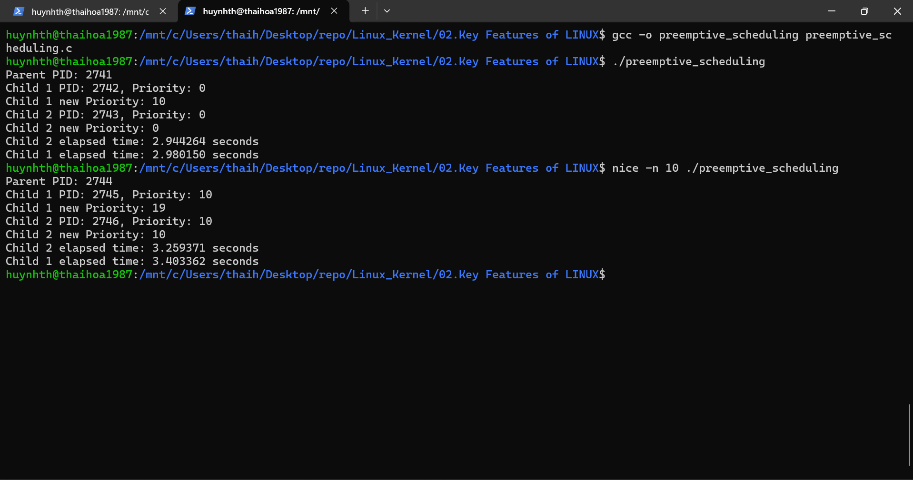

### Làm việc với Kernel Modules ###
Đề bài: 
* Kiểm tra các module kernel đang chạy: lsmod
* Xem thông tin về một module cụ thể: modinfo ext4

-----

lsmod & modinfo ext4

### Quản lý tiến trình trong Linux ###
Đề bài:
* Liệt kê tất cả tiến trình đang chạy: ps aux
* Xem thông tin tiến trình theo thời gian thực: top
* Kết thúc một tiến trình cụ thể: kill -9 <PID>

* Hướng dẫn làm:

	Kiểm tra PID bằng ps aux trước khi dùng kill.

	Quan sát thay đổi trước và sau khi kill tiến trình.

-----

ps aux

top

	
kill -9 <PID>

### Tạo và quản lý thread trong Linux bằng C ###
Bài tập:
* Viết chương trình tạo 3 thread in ra thông điệp.
* Sử dụng pthread_create(), pthread_join().
* Kiểm tra ID của từng thread.
* Hướng dẫn làm:

	Cài đặt gcc nếu chưa có (sudo apt install gcc).
	
	Biên dịch chương trình với -lpthread.

	Quan sát thứ tự thực thi của các thread.
	
-----

[`manage_threads_in_linux.c`](manage_threads_in_linux.c)

### Lập trình với Preemptive Scheduling ### 
Bài tập:
* Viết chương trình tạo 2 tiến trình con.
* Dùng nice để điều chỉnh mức độ ưu tiên.
* Kiểm tra mức ưu tiên bằng ps -eo pid,pri,ni,cmd.
* Hướng dẫn làm:

	Thử chạy tiến trình với nice -n 10 ./program.
	
	Quan sát xem tiến trình nào chạy nhanh hơn.
	
-----

[`preemptive_scheduling.c`](preemptive_scheduling.c)
