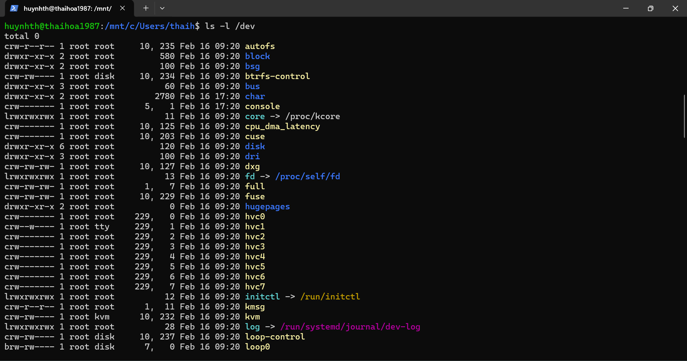
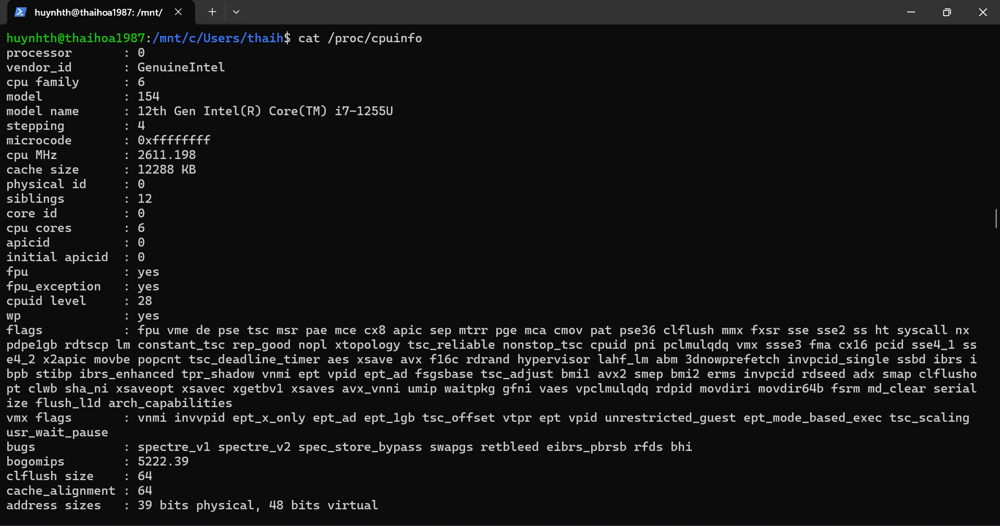
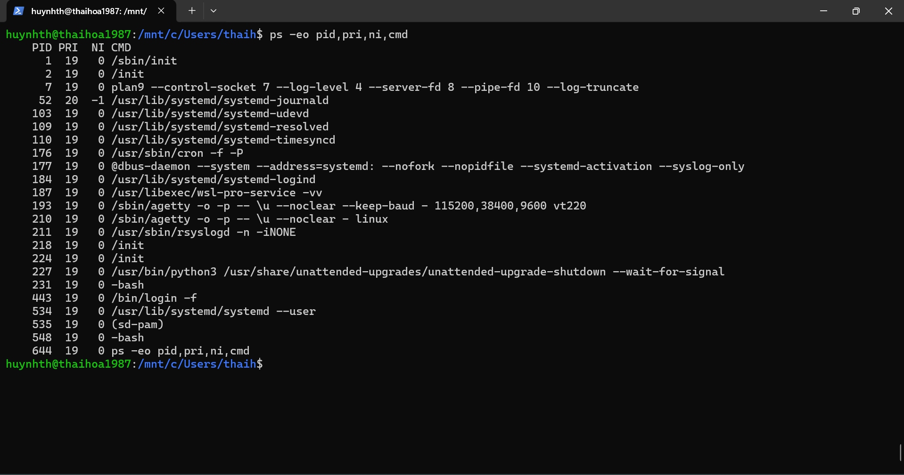

### Bài 1: So sánh Monolithic Kernel và Microkernel ###
Đề bài: 
* Trình bày sự khác biệt giữa Monolithic Kernel và Microkernel.
* So sánh ưu nhược điểm của hai mô hình này về hiệu suất, bảo trì, bảo mật.
* Giải thích tại sao Linux sử dụng Monolithic Kernel nhưng vẫn có tính linh hoạt cao.
-----

(a) Monolithic Kernel: cả OS sẽ chạy như 1 program. User services và Kernel services được implemented trong cùng một address space.
Toàn bộ OS với loạt core functions: memory management, process management, device drivers, and file systems, được gộp thành 1 block lớn chạy trong cùng 1 address space.

Microkernel: user services và kernel services được implemented trong những address space khác nhau. User services sẽ nằm ở user address space và kernel services nằm ở kernel address space.
Chỉ những functions tối quan trọng mới được đem vào kernel, gồm communication HW-SW, quản lý tiến trình.
Những services khác như: device drivers, file systems, network protocols sẽ chạy ở user space dưới những process riêng biệt.

(b)
|               | Microkernel                                     | Monolithic Kernel                               |
|------------- |-----------------------------------------------|-----------------------------------------------|
| **Hiệu suất** | Tốc độ thực thi chậm.                         | Tốc độ thực thi nhanh.                        |
| **Bảo trì**   | Đơn giản                                      | Cần nhiều thời gian, công sức để bảo trì.      |
| **Bảo mật**   | An toàn hơn (chỉ những services quan trọng mới chạy trong kernel mode). | Kém hơn (nếu một process/service crash, cả một system sẽ crash vì user & OS ở cùng một address space). |

(c)
Linux mặc dù sử dụng Monolithic kernel vẫn có tính linh hoạt cao vì:
Modular design hay cụ thể là loadable kernel modules, tức modules có thể load hoặc unload khi cần tại runtime mà không phải reboot.

### Bài 2: Mô hình "Everything as a File" trong Linux ###
Đề bài:
* Giải thích mô hình "Everything as a File".
* Nêu các đối tượng trong Linux hoạt động như file (ví dụ: thiết bị, tiến trình).
* Chạy lệnh kiểm tra và phân tích đầu ra để chứng minh rằng Linux áp dụng mô hình này.
* Hướng dẫn làm:

	Giải thích mô hình:	Định nghĩa “Everything as a File” và lợi ích của nó.

	Các đối tượng hoạt động như file: Lấy ví dụ về file /dev, /proc, socket, process descriptor.
	
	Thực hành: Dùng các lệnh ls -l /dev, cat /proc/cpuinfo, echo "Test" > /dev/null để kiểm tra.
-----

(a) Chúng ta có 4 tương tác cơ bản với files: open / read / write / close
Một file có thể nằm trên hard disk, CD ROM, USB nhưng vẫn được tương tác qua 4 bước trên, content sẽ được stream như nhau.
Trong UNIX OS, "Everything as a File" bởi vì có thể thực hiện 4 tương tác với tất cả cho tất cả files trên bất kỳ thiết bị lưu trữ hay đến bất kỳ peripherals. Điều khác nhau chỉ là source của data.

Ví dụ: người dùng gõ vào terminal, tức là đang “write” vào standard input.
       Thông tin hiển thị ra terminal từ lệnh echo, nghĩa là OS đang “write” vào standard output.
		Tương tự với một network connection. 
		Tạo một network connection đến server, tức là đang “open”.
		Gửi request đến server, tức là đang “write”.
		Khi server respond, tức là user đang “read”.
		Khi kết thúc communication, user sẽ “close”.
		Dữ liệu cũng sẽ được truyền dưới dạng 1 stream.

Như vậy, có thể sử dụng cùng bộ APIs cho những nhiệm vụ khác nhau. Cụ thể, API sẽ cần làm việc với một file descriptor. Mỗi một file khác nhau sẽ có một file descriptor khác nhau.
Standard input có file descriptor là 0. Standard output có file descriptor là 1.

(b)
__Processes__: Mỗi process có 1 folder là /proc/$PPID/, với $PPID là process id tương ứng.

__Devices__: Mỗi một device cũng thể hiện dưới dạng 1 file. Nếu đĩa cứng kết nối đến SCSI controller, thì nó sẽ xuất hiện dưới dạng /dev/sda với phân vùng đầu tiên là /dev/sda1.
         Nếu hoạt động đọc ghi đến /dev/sda, nghĩa là đang đọc dữ liệu trực tiếp từ đĩa cứng.
		 
__Network sockets__: bash sử dụng /dev/tcp/$host/$port để xác định TCP ports hoặc UDP. Nhìn chung, có thể tìm thông tin về sockets tại /proc/net/{tcp,udp}

__Others__: Standard input cũng là 1 file và được quy định là /dev/stdin, tương tự cho standard output.
        Đọc từ /dev/zero sẽ được zeros, và từ /dev/random sẽ được high-quality random numbers.
		
(c)
ls -l /dev

cat /proc/cpuinfo

	
echo "Test" > /dev/null

### Bài 3: Cách Linux thực hiện Preemptive Multitasking ###
Đề bài:
* Giải thích Preemptive Multitasking là gì.
* Mô tả vai trò của Linux Scheduler trong việc quản lý tiến trình.
Hướng dẫn làm:

	Giải thích: Phân biệt Preemptive Multitasking và Cooperative Multitasking.
	
	Vai trò của Scheduler: Mô tả thuật toán Completely Fair Scheduler (CFS) và các yếu tố quyết định scheduling.
	
	Thực hành kiểm chứng: Dùng ps -eo pid,pri,ni,cmd kiểm tra mức ưu tiên của tiến trình.

-----
(a)
__Preemptive__:
Scheduler (của OS) sẽ quyết định tại thời điểm nào threads nào được phép run, threads nào phải sleep.

__Cooperative__:
Mỗi threads sẽ tự quyết sử dụng CPU trong bao lâu. Nếu một thread không muốn share CPU thì những threads khác cũng chịu. Scheduler không có tiếng nói gì trong trường hợp này.

(b)
Classic Preemptive Scheduling vs. CFS
* Classic Preemptive Scheduling: Sử dụng timeslices cố định and nhiều priority queues. Mỗi process sẽ có 1 khoảng thời gian cố định để sử dụng CPU trước khi bị pre-empted (chuyển sang process khác).
* CFS: Không sử dụng timeslices cố định và priorities tường minh. Thay vào đó, sẽ tính toán linh động thời gian 1 task sử dụng CPU dựa trên số tasks hiện hành và nhu cầu của chúng.

Key Features of CFS
* Target Latency: Thời gian tối thiểu để mỗi runnable task được quyền sử dụng CPU ít nhất một lượt. Mặc định là 20ms.
* 1/N Slice: Mỗi task sẽ có 1 timeslice trên target latency, bằng cách chia target latency cho số task (N).
* Minimum Granularity: Thời gian tối thiểu 1 task được phép chạy trước khi bị pre-empted, thường từ 1ms đến 4ms.
* Virtual Runtime (vruntime): Theo dõi tổng thời gian 1 task đã chạy trên CPU. Nếu một task có vruntime nhỏ, sẽ được ưu tiên chạy ở lượt kế tiếp.

CFS Implementation
* Red-Black Tree: A self-balancing binary search tree để dễ lựa chọn task dựa trên vruntime.
* Runqueue: Hàng đợi để các task được phép tiếp cận CPU.

(c)
ps -eo pid,pri,ni,cmd
